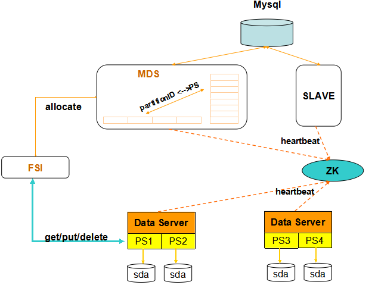
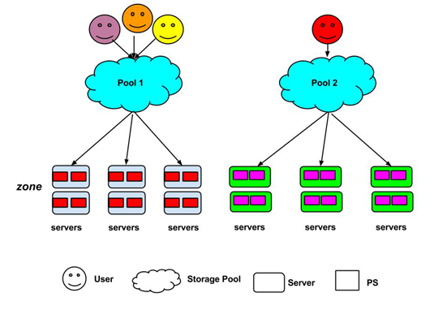
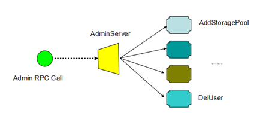
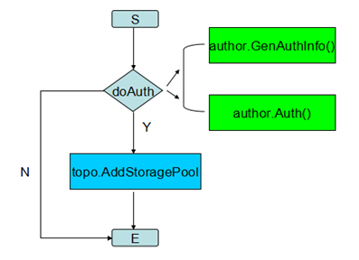
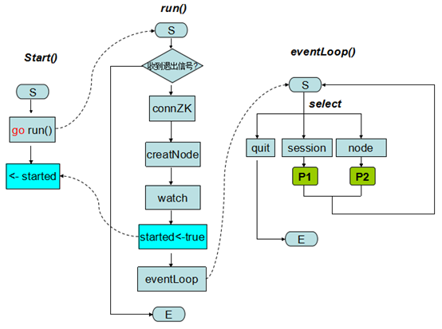
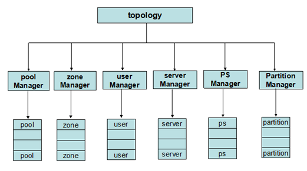
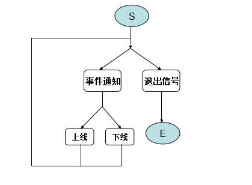
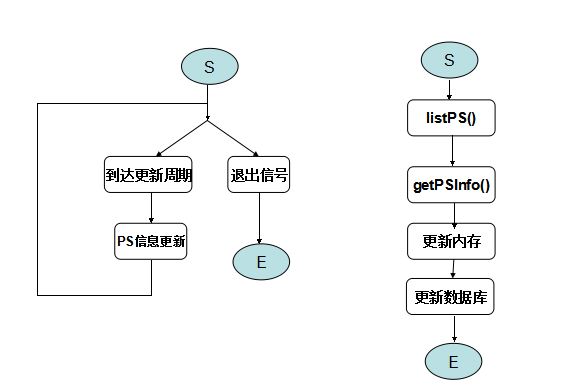
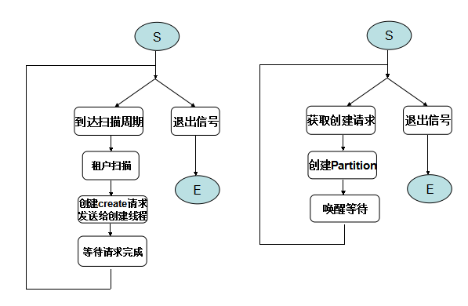

# NEFS-MDS详细设计

[toc]

## 概述

NEFS是网易杭研针对互联应用场景设计实现的新一代分布式文件系统,继承了现有系统的高可靠、扩展性强优势,同
时也在以下方面有效解决现有系统不足之处：
> 1. 将小对象合并存储于大文件,有效消除了海量小文件的存取性能瓶颈；
> 2. 使用了高效强一致性协议,达到数据副本字节一致性目标,解决了分布式存储中多副本数据一致性难题；
> 3. 多对多恢复可进一步降低故障数据恢复时间,增强数据可靠性;
> 4. 使用纠删码技术代替多副本,保证数据相同级别可靠性同时提升物理磁盘利用率,降低成本。

NEFS-MDS作为系统控制节点,扮演了系统大脑的角色。
* 首先,MDS管理着系统所有的存储节点,并将存储节点的实时状态反应在MDS上,进而将这些状态反馈给客户端。
* 其次,MDS定义了系统全局拓扑结构,并根据系统状态变化实时更新拓扑；
* 同时，MDS为客户端提供接口,允许客户端查看、修改系统拓扑，并调度客户端读写至不同的存储节点；
* 最后，MDS还负责系统中一些任务的调度功能，如数据迁移、数据恢复等。

本文档主要描述Nefs-MDS设计，文档结构如下：
* 第二章描述了NEFS系统整体架构以及MDS维护的系统全局拓扑结构;
* 第三章详细描述了MDS使用的数据库表设计;
* 第四章则按照模块为单位阐述了MDS内部细节：
> 4.1 列举了MDS支持的系统配置参数;  
> 4.2 阐述了MDS管理服务器对外接口以及内部实现  
> 4.3 描述了MDS ZK模块的内部实现细节；  
> 4.4 阐述了MDS 对客户端和数据节点提供的服务接口；  
> 4.5 描述了MDS核心模块的内部实现。

* 附录给出了MDS使用的"副本选择算法"的理论证明。

## 系统架构

NEFS系统由客户端(FSI)、元数据节点(MDS)、数据节点(PS)三部分组成。系统结构如下图所示：



* FSI:   客户端给使用方提供集群读写删接口;  
* MDS:   集群控制节点, 管理集群所有数据节点并为客户端分配写空间;  
* PS:    集群存储节点,为客户端提供读写删除等数据访问接口;  
* ZK:    Zookeeper用来管理集群成员;  
* Mysql: MDS使用Mysql存储集群元信息。  

从MDS角度观察系统拓扑如下：



以下逻辑概念组成了系统全局拓扑图：

* __存储池__：物理服务器集合，但存储池以域为单位管理所有物理服务器。存储池实现了用户数据的物理隔离，某些特定产品可能需要使用单独的存储池；
* __租户__：系统资源使用者,每个租户使用特定存储池存放数据； 
* __域__：域是物理服务器集合，引入域可带来如下优势：
> __增强数据可靠性__：不同域的机器在物理位置上隔离,而不同的副本位于不同域上,可增强多副本的数据可靠性；    
> __简化运维__：运维操作可以域为单位进行。如搬迁物理服务器时可批量搬迁某个域下面所有的物理服务器而不会导致某个Partition的所有副本全部不能访问的情况，减小数据迁移的复杂度。    
* __物理服务器__：普通线上服务器,但上线时会被分配至特定存储池的某个域；
* __PS__： 系统存储节点，每个PS进程管理物理服务器上的一块磁盘；
* __Partition__： 系统数据写入所在地，对于小文件，Partition对应了物理上的一个大文件,众多小对象被合并写入大文件；对于大对象写入,Partition对应了物理上的目录，大对象存放于该目录下。
而且partition也是数据迁移和恢复的基本单位。

## 数据库表
NEFS-MDS使用数据库(MYSQL)持久化系统部分元数据信息,如存储池、租户、域等,本章节主要描述数据库表结构以及各字段含义。

__存储池信息表__
```
create table Nefs_Pool (
    PoolName    varchar(256)  NOT NULL  COMMENT 'Storage pool name',
    primary key (PoolName)
);
```
**PoolName**: 存储池名称

__租户信息表__
```
create table Nefs_User (
    UserName              varchar(256)  NOT NULL COMMENT 'UserName',
    Passwd                varchar(256)  NOT NULL COMMENT 'User password',
    Pool                  varchar(256)  NOT NULL COMMENT 'Pool user belongs to',
    DefaultAllocStragety  Blob,
    primary key  (UserName)
);
```
**UserName**: 租户名称;  
**Passwd**:   租户密码,当前未使用;  
**Pool**:     租户所属存储池;  
**DefaultAllocStragety**: 租户的默认存储策略,由存储介质和副本数组成,如"ssd-2";

__域信息表__
```
create table Nefs_Zone (
    ZoneID  bigint       NOT NULL COMMENT 'ZoneID',
    Pool    varchar(256) NOT NULL COMMENT 'Pool zone belongs to',
    primary key (ZoneID)
);
```
**ZoneID**: 域ID;
**Pool**:   域所属存储池

__物理服务器信息表__
```
create table Nefs_Server (
    IP       varchar(32)  NOT NULL COMMENT 'IP address',
    Pool     varchar(256) NOT NULL COMMENT 'pool server belongs to',
    Zone     int          NOT NULL COMMENT 'Zone server belongs to',
    DiskType varchar(32)  NOT NULL COMMENT 'Disk type of physical server',
    primary  key (IP)
);
```
**IP**:   物理服务器IP地址;  
**Pool**: 物理服务器所属存储池;  
**Zone**: 物理服务器所属域;  
**DiskType**: 物理服务器磁盘类型, 如"SSD"等  

__PartitionServer信息表__
```
create table Nefs_PartitionServer (
    PSID       bigint       NOT NULL COMMENT 'PS ID',
    Token      varchar(32)  NOT NULL COMMENT 'Token to indenty PS',
    Start      bigint       NOT NULL COMMENT 'PS Start time',
    IP         varchar(32)  NOT NULL COMMENT 'IP Address of PS',
    Port       int          NOT NULL COMMENT 'need or not',
    DiskType   varchar(32)  COMMENT 'Disk type, HDD/SSD',
    DiskState  int          NOT NULL COMMENT 'Status of disk, DiskError/DiskReadOnly/DiskNormal',
    Capacity   bigint       COMMENT 'Disk capacity',
    Free       bigint       COMMENT 'Disk free space',
    Fs         varchar(32)  COMMENT 'File system name',
    Mounted    varchar(512) COMMENT 'Mount point of disk',
    primary key (PSID)
);
```
**PSID**: PartitionServer ID;  
**Token**: PS token;  
**Start**: PS启动时间;  
**IP**: PS所属物理服务器Ip地址;  
**Port**: PS启动端口;  
**DiskType**: PS管理磁盘介质类型,如"SSD"、"SATA"等;  
**DiskState**: PS管理磁盘当前状态,如磁盘错误、磁盘只读等;  
**Capacity**: PS管理磁盘容量;  
**Free**: PS管理磁盘空闲空间;  
**Fs**: PS管理磁盘的文件系统类型,如"ext3"、"ext4"等;  
**Mounted**: PS管理磁盘的挂载点  

__Partition表__
```
create table Nefs_Partition (
    PID            bigint        NOT NULL COMMENT 'PartitionID',
    Epoch          bigint        NOT NULL COMMENT 'Pertition version',
    Type           tinyint       NOT NULL COMMENT 'Partition type, big/small file',
    User           varchar(256)  NOT NULL COMMENT 'partition owner',
    Size           bigint        NOT NULL COMMENT 'Partition data size',
    Free           bigint        NOT NULL COMMENT 'Partition free space',
    Replications   Blob          COMMENT 'Replication PSID list',
    primary key    (PID)
);
```
**PID**: partition ID;  
**Epoch**: partition 当前版本;  
**Type**: partition 类型,当前支持BigPartition和SmallPartition两种;  
**User**: partition所属租户;  
**Size**: partition已写入数据量大小;  
**Free**: partition剩余空间;  
**Replicates**: partition副本(PS)列表,实际存储中将副本的ID格式化后再存储  

__管理员信息表__
管理员信息表存储系统管理员信息,以便后续对系统运维者进行身份和权限认证。
```
create table Nefs_Admin (
    Admin    varchar(256)    NOT NULL  COMMENT 'Administrator name',
    Password varchar(256)              COMMENT 'Administrator password',
    ACL      tinyint         NOT NULL  COMMENT 'Administrator permissions',
    primary key (Admin)
);
```
**Admin**: 管理员名称;
**Password**: 管理员密码;
**ACL**: 管理员权限信息,当前未使用

## 系统模块

### 系统配置
MDS支持多种系统配置参数，用户在启动MDS时可以指定参数来决定系统运行时行为，MDS支持的可配置参数如下
```
clusterKey:      NEFS集群Key,默认"nefs-1024"

dbAddr:          MDS使用Mysql地址,默认值"127.0.0.1:4338"

dbUser:          MDS连接数据库user,默认"root"

adminAddr:       MDS管理服务器启动地址,默认"0.0.0.0:9876"

rpcAddr:         MDS RPC服务器启动地址,默认"0.0.0.0:9877"

writeQuota:      MDS分配客户端写配额上限(单位MB),默认100

updateInterval:  MDS后台PS信息更新周期(单位s),默认300

scanInterval:    MDS后台异步创建任务扫描周期(单位s),默认300

createThreshold: 租户异步创建触发阈值,租户可写Partition低于该值时启动异步创建,默认5

partitionSize:   NEFS partition 大小(单位GB),默认10

psZkDir:         PS节点在ZK服务器路径,默认"1/nefs/ps"

mdsZkDir:        MDS节点在ZK服务器路径,默认"/1/nefs/master"

zkAddr:          ZK服务器地址,默认"127.0.0.1:4438"

zkTimeout:       ZK服务器超时配置(单位s),默认5

// config about MDS-PS rpc client socket pool
maxConnPerHost:  MDS与PS连接池大小配置,默认100

socketTimeout:   MDS与PS socket超时配置(单位s),默认5
```

### 管理服务器

MDS管理服务器用来处理管理员对系统的诸如查询、修改等指令的服务模块。客户端(主要是管理员小工具)通过http-rpc的形式调用管理服务器提供的接口。

#### 接口定义

MDS管理服务器接口具体请参考[NEFS-admin接口定义](http://doc.hz.netease.com/download/attachments/37298943/Nefs-admin%E6%8E%A5%E5%8F%A3%E5%AE%9A%E4%B9%89.docx)

#### 数据结构

```
type AdminContext struct {
    addr   string
    topo   topology.Topology
    author Author
}
```

此为管理服务器核心数据结构:
* addr: 管理服务器的本地启动地址(ip:port)
* topo: 管理服务器依赖的系统核心模块指针
* author: 管理服务器认证方式

#### 内部实现

MDS管理服务器对请求指令的处理流程如下图所示:



下图则以**"添加存储池"**为例说明了每个管理员的指令在管理服务器内部的处理流程



1.对每个请求，首先调用doAuth()对请求进行身份认证:
> 1. 根据系统当前使用的认证方法将用户传入的身份信息构造成认证消息
> 2. 调用系统当前使用的认证方法的认证逻辑对消息进行认证,当前只实现了简单的基于"用户名-密码"认证方式
> 3. 如果认证失败，则直接返回认证失败错误

2.调用拓扑管理模块相应的接口进行实际处理并返回处理结果.

### Zookeeper管理模块

MDS通过Zookeeper来侦听系统所有数据节点成员状态。通过监听ZK节点变化来监听数据节点的上下线事件,并对该事件作相应地处理以保证系统状态正确。


PS和MDS启动时候均将自己注册到ZK的某个目录下,并写入特定数据,具体形式如下:
```
$Parent/clusterID/nefs/master => ip,port,starttime
$Parent/clusterID/nefs/ps/id-token-ip-port-starttime
```
MDS的Zookeeper模块主要处理下列任务:

1. 启动时连接配置中指定的Zookeeper并在指定目录下创建MDS节点并写入自身信息(ip-port-start)
2. 启动时获取Zookeeper上记录的所有当前PS节点信息，处理这些已上线节点;
3. 启动后台任务监听MDS与Zookeeper之间的连接事件以及PS节点上下线事件;

#### 数据结构
```
type ZkClient struct {
    peers        string   // zk server地址
    psNodeDir    string   // ps注册节点根目录
    mdsNodeDir   string   // mds注册节点目录
    mdsNodeData  string   // mds注册节点数据
    conn         nzk.Conn 
    baseTimeout  time.Duration // zk服务器读写超时
    connTimeout  time.Duration // zk服务器连接超时
    sessChan     <-chan zookeeper.Event // zk连接失效事件管道
    watchChan    <-chan zookeeper.Event // ps上下线事件管道
    quit         chan struct{}          // MDS进程退出信号管道
    cbs          map[string]eventCb     // 事件的回调处理函数
    topo         topology.Topology      // 依赖核心模块指针
}
```
该数据结构为MDS Zookeeper管理模块核心数据结构。Zk模块通过该结构即可处理PS节点的上下线事件、ZK连接断开事件等。

#### 内部实现

##### Zookeeper模块启动

Zk模块启动主要: 连接Zookeeper、注册监听事件、启动新协程处理ZK事件等。下图Start()描述了Zk模块的启动流程：



1. 启动新协程run()处理启动过程中需要初始化的部分,同时当前线程等待run()协程处理完成;
2. run()协程内部处理流程如下:
> 1. 如果收到主进程的退出信号,则退出;
> 2. 连接Zk服务器;
> 3. 创建MDS在Zk服务器节点并写入节点数据;
> 4. 读取Zk服务器PS注册目录下所有节点信息,处理当前已上线所有数据节点,如何处理数据节点的上下线事件会在后面详述;
> 5. 通知等待的主线程ZK模块初始化完成;
> 6. run()协程进入eventLoop()继续运行,eventLoop()内部会监听Zk服务器通知的事件,并对特定的事件类型进行相应处理。

##### Zk服务器事件处理

__连接断开、session过期事件处理__ 
> 1. 发送报警
> 2. MDS进程退出，避免在MDS集群配置下产生多主现象

__PS节点变化事件处理__
> 1. 分别获取本地和Zk Server上的PS节点信息;
> 2. 对比本地节点和Zk Server节点状态,分辨出哪些PS下线而哪些PS又上线,具体方法：
    - 对Zk服务器上的所有节点进行去重处理,对PS-ID和token相同的节点对比其启动时间,只保留最近启动的节点。必须这么做的原因是由于如果快速重启PS的话,在ZK服务器的ps目录下会有两个同样的psid节点,具体可参考[NEFS-70](http://jira.hz.netease.com/browse/NEFS-70);
    - 获取当前MDS上存储的所有Offline状态的PS,再与当前ZK上获取的所有节点取交集,得到本次新上线的PS节点;
    - 获取当前MDS上存储的所有Online状态的PS,对每个PS,如果其没有出现在Zk服务器的PS节点列表中或者Zk服务器上的该节点的启动时间大于本地PS的,则认为该节点已下线
> 3. 对2中搜集到的所有变化节点信息封装成请求,通知拓扑管理模块,由它负责修改系统拓扑信息。具体的ZK事件处理见“MDS后台任务-ZK事件处理”。

### RPC服务器

RPC服务器类似管理服务器,只是RPC服务器提供了FSI和PS的访问接口，FSI或者PS调用MDS的RPC服务器提供的接口完成相应功能。

#### 接口定义

RPC服务器对PS和FSI提供接口定义如下：
```
// FSI相关接口
AllocateQuota(req *proto.WriteQuotaRequest) (*proto.WriteQuotaResponse, *proto.NefsException, error)
GetPartitionInfo(req *proto.PartitionInfoRequest) (*proto.PartitionInfo, *proto.NefsException, error)

// PS相关接口
AllocateServerID(req *proto.ServerIDReq) (*proto.ServerIDRep, *proto.NefsException, error)
ReportError(req *proto.ErrorRequest) (*proto.NefsException, error)
SyncPartitionDone(req *proto.SyncPartitionDone) (*proto.SyncPartitionDoneRep, *proto.NefsException, error)
```

#### 内部实现

以AllocQuota接口为例, RPC服务器收到调用后处理流程如下:
> 1. 调用doFSIAuth()来对客户端进行身份认证，当前实现了简单的基于cluster-key的认证方式;
2. 调用核心拓扑模块的AllocQuota()函数完成具体的功能;
3. 封装返回结果给FSI客户端。

PS接口实现类似FSI接口实现,只是无需步骤1的认证。关于核心模块的处理流程会在后面的"拓扑模块"中详细说明。

### 拓扑模块

拓扑模块被上面描述的所有其他外部模块依赖。是MDS的最核心组成，在拓扑模块内定义了系统核心数据结构，实现了核心访问接口。

#### 数据结构

MDS定义了树形拓扑，整个系统定义了存储池、域、物理服务器、PS、Partition等概念，这些数据结构描述如下图所示：
```
// 系统存储池管理者
type NefsPoolManager struct {
    sync.RWMutex
    pools map[string]*NefsStoragePool
}
// 存储池描述结构
type NefsStoragePool struct {
    sync.RWMutex
    poolName string
    users    map[string]*NefsUser // 存储池下所有user列表
    zones    map[int32]*NefsZone  // 存储池下所有zone列表
}
```
```
// 系统域管理者
type NefsZoneManager struct {
    sync.RWMutex
    nextZoneID int32
    zones      map[int32]*NefsZone
}
// 域描述结构
type NefsZone struct {
    sync.RWMutex
    zoneID  int32
    pool    *NefsStoragePool
    servers map[string]*NefsServer // 域下所有物理服务器列表
}
```
```
// 系统租户管理者
type NefsUserManager struct {
    sync.RWMutex
    users map[string]*NefsUser
}
// 租户描述结构
type NefsUser struct {
    locker      sync.RWMutex
    allocLocker sync.RWMutex
    userName    string
    pool        *NefsStoragePool
    collections []*collection     // 租户所有存储策略列表
}
```
```
type collection struct {
    diskType   string
    replicates int32
    partitions []*NefsPartition // 存储策略下所有Partition列表
}
```
分配策略(collection)是[磁盘介质-副本数]的二元组，而每个租户可有多种分配策略。
```
// 系统物理服务器管理者
type NefsServerManager struct {
    sync.RWMutex
    servers map[string]*NefsServer
}
// 物理服务器描述结构
type NefsServer struct {
    sync.RWMutex
    ip       string
    diskType string
    zone     *NefsZone
    pool     *NefsStoragePool
    ps       map[int32]*NefsPartitionServer // 物理服务器上所有PS列表
}
```
```
// 系统PS管理者
type NefsPSManager struct {
    sync.RWMutex
    nextPSID    int32
    partServers map[int32]*NefsPartitionServer
}
// PS描述结构
type NefsPartitionServer struct {
    sync.RWMutex
    id    int32
    token string
    start int64
    ip    string
    port  int32
    state int16

    // number of primary partitions this ps contains
    primaryParNum int64
    server        *NefsServer

    // information about disk
    diskType   string
    fsType     string
    mountPoint string
    diskState  int32
    capacity   int64
    free       int64
    partitions []*NefsPartition  // PS下所有Partition列表
}
```
```
// 系统Partition管理者
type NefsPartitionManager struct {
    sync.RWMutex
    partitions map[int64]*NefsPartition
    nextID     int64
}

// Partition副本布局信息
// replicates[0] is primary copy
type LayOut struct {
    replicates []*NefsPartitionServer
}

// partition描述结构
type NefsPartition struct {
    sync.RWMutex
    partitionID   int64
    epoch         int64
    partitionType int16
    capacity      int64
    contentSize   int64
    free          int64
    readOnly      bool
    opened        bool
    // open flag of replicate of partition
    openMap []bool

    user   *NefsUser
    layout *LayOut  // partition副本位置信息
}
```
上述各数据结构之间的关系如下图所示：  



#### 关键流程

拓扑模块对外提供的接口比较多，按照功能科划分为三大部分：
* 为管理服务器提供的接口；
* 为RPC服务器提供的接口。

下面分别阐述各接口的内部处理流程

##### 管理服务器接口

拓扑模块对管理服务器提供的接口比较多,以AddPool为例说明接口处理流程

***AddPool(poolName string) error***

1. 检查PoolName是否有效，如果错误返回具体错误原因；
2. 将PoolName构造记录插入数据库表，如果出错返回错误原因"Internal Error"；
3. 将Pool添加到全局PoolManager结构中；
4. 为Pool添加默认数量(3个)的域；
5. 返回

##### RPC服务器接口

***AllocateQuota(user string, diskType string, repli int32, parType int16)***

拓扑模块AllocateQuota核心流程如下:

1. 根据user名查找该user是否存在,如果不存在,返回错误"User Not Exist";
2. 检查diskType和repli是否有效,如果无效,返回错误"Invalid Argument";
3. 根据diskType和repli拼接的存储策略在本地查找collection;
4. 从collection内分配类型为parType的可写Partition:
> 1. 遍历当前collection所有Partition,筛选出类型为parType的可写Partition;
> 2. 对1筛选出的所有Partition按照空闲空间从大至小排序;
> 3. 按照2的顺序挑选一定数量Partition,对个Partition,分配一定大小的写配额,同时减少该Partition空闲空间;

5. 如果4中没有分配出可写Partition,意味着本地没有配额缓存了,创建一个该类型的Partition,重试次数增加1并转步骤4

***AllocateServerID(ip string, diskPath string, partitionID []int64) (int32, string, error)***

PS启动时检查发现如果尚未分配ID,则通过RPC调用AllocateServerID()申请ID,具体处理流程如下:

1. 查找参数1的ip在本地是否存在,如果不存在,则返回错误"Server not exist";
2. 检查partitionID列表是否为空,如果不为空,意味着可能发生某些意外导致ID丢失,报警,由管理员介入处理;
3. 分配PSID和token;
4. 向数据库中插入一条PS记录;
5. 将该PS插入至全局PS管理器中;
6. 将该PS插入至ip对应server的孩子列表中;
7. 返回PSID和token.

***PSOnline(psID int32, token string, start int64, ip string, port int32) error***

MDS通过ZK检测到PS上线事件,进入PS上线事件处理,具体流程为:

1. 根据参数的PSID本地查找PS是否存在,若不存在则返回错误"PS Not Exist";
2. 检查本地PS的token和请求参数中token是否匹配,如果不匹配,返回错误"Invalid Argument";
3. 向PS发送获取PS信息的RPC请求,以获取PS的磁盘信息,如磁盘的容量、空闲空间等;
4. 检查PS的IP和port是否发生改变,如果有,更新本地PS记录的IP和port字段并记录日志;
5. 更新PS的状态为Online;
4. 更新数据库中PS对应的记录的信息;
5. 调用PS的OpenPartition接口打开PS上所有的Partition,Partition被打开后才可以被写入;

***PSOffline(psID int32) error***

一旦某些PS断开,MDS可通过Zk检测到该PS离线事件,并进入以下处理流程:

1. 根据psID查找本地PS,如果未找到,返回错误 "PS Not Exist";
2. 标记PS状态为Offline;
3. 将该PS上所有的Partition标记为Close,这些Partition不可再被写入;

#### Partition副本选择算法

MDS的主要任务是管理系统所有的存储节点并在客户端请求的时候挑选合适的存储节点并创建数据副本,以供客户端写入。而挑选算法直接决定了整个系统内的存储节点是否均衡,这里的均衡既包含存储空间的均衡,也包括存储服务器其他资源的均衡利用,如网卡等。
数据副本挑选需要满足的第一原则是个副本的可靠性：
> N个副本需要位于不同域内,由于每个物理服务器只能隶属于一个域,因此每个副本天然就位于不同的物理服务器,尽量减少了数据丢失可能性。

因此,Partition的副本挑选过程分成如下两阶段：

**存储池内选择域**

1. 遍历存储池下的所有域,晒出选满足条件的所有域：如果该域下面满足条件的存储节点 >= 1,认为该域满足条件,并根据可写存储节点数量决定域的权重;
2. 从1中筛选出的满足条件域中根据域权重随机选择副本数量的域;

** 域内随机选择存储节点 **

1. 扫描域内所有存储节点,筛选出所有的可写存储节点,当前每个存储节点权重均为1;
2. 从1的结果中根据权重随机选择出1个可写存储节点。

而从存储池内选择域以及在域内选择存储节点均采用了随机选择算法，具体算法描述如下：

> 对于任意的i(1 <= i <= n),按照如下方法给第i个元素分配一个键值key(其中ri是一个0到1之间等概率分布的随机数):  
                         
> 之后，如果要随机选取m个,就取key最大的m个即可。

该算法的证明见"附录A"。

#### 后台任务

##### PS节点上下线事件监听任务

根据前面的设计文档, "ZK模块"用来监听Zk服务器上的节点上下线事件,而监听到该事件后,Zk模块会将该事件通知给"拓扑模块",拓扑模块初始化时会启动一个后台任务接收ZK模块的事件通知,对于不同的事件,进行特定处理。

描述节点上下线事件的数据结构如下:
```
type EventNode struct {
    EventType int     // 事件类型,目前支持"PS节点上线"和"PS节点下线"两种事件
    ID        int32   // PS节点ID
    IP        string  // PS节点IP
    Port      int32   // PS节点port
    Token     string  // PS节点token
    Start     int64   // PS节点启动时间
}
```
监听线程的处理流程如下图所示：

* 对每种事件处理都启动一个新的线程处理,这是为了避免某个事件处理时间过长而阻塞其他事件的处理
* 对上线事件的处理见前面"关键流程"中的PSOnline
* 对下线事件的处理见前面"关键流程"中的PSOffline

##### PS节点信息更新任务

由于数据节点PS与MDS节点之间不存在定期心跳,MDS无法获取PS节点以及其上面所包含的Partition的最新状态信息。为此,MDS维护了后台任务以定期获取PS及其管理的Partition的当前状态信息。



##### Partition异步创建任务

客户端写数据前需要向MDS申请写配额，MDS分配写配额时需要首先在PS上创建Partition,这需要与多个副本所在数据节点进行RPC交互,属于比较耗时的过程,而这个耗时最终会反映在客户端的写效率上。为了尽量在客户端每次申请写配额时无需进行数据副本的创建,MDS实现了异步创建:MDS内部存在后台线程,定期扫描租户的可写Partition数量,如果发现数量不足,则在客户端分配写配额请求来到前就预先创建好需要的数据副本,客户端请求时直接从MDS中已创建好的Partition中分配即可。

MDS异步创建行为由以下两个参数决定:
> 1. **ScanInterval**: 扫描周期,异步创建线程每隔特定时间间隔进行一次扫描,决定某个租户是否需要进行异步创建;
2. **CreateThreshold**: 异步创建阈值, 租户可写Partition数量have低于该值时，认为需要创建partition，且创建Partition数量为(CreateThreashold - have)

内部实现上,MDS异步创建功能由扫描线程和创建线程组成,其中:
> **扫描线程**：扫描所有租户的可写配额数量，如果发现数量不足，则构造Partition创建请求，并将请求转发给创建线程;
**创建线程**：负责处理扫描线程提交的Partition创建请求;

扫描和创建线程主要流程如下图所示：



Partition创建过程如下所示:
> 1.  为Partition挑选副本,具体见"副本选择算法"
2.  并发向从节点发送创建Partition请求;
3.  等待2中所有从副本创建返回,并检查返回结果,如果有副本创建失败，转步骤8；
4.  向主副本发送创建Partition请求，判断返回结果,如果失败,转步骤8；
5.  将创建的Partition记录插入数据库;
6.  将创建的Partition添加到包含的各副本的Partition列表中;
7.  将创建的Partition添加到所属租户的Partition列表中,返回;
8.  至此说明创建过程失败，删除已创建成功的副本。

#### main模块

main模块负责组织系统所有其他模块,并根据外部信号对系统进行特定处理,如收到外部的terminate信号时优雅地停止系统运行。

main模块启动处理流程如下:
> 1. 根据启动参数加载MDS配置;
2. 注册信号处理函数;
3. 打开数据库;
4. RPC客户端初始化,主要是初始化与数据节点的RPC连接池;
5. 初始化系统拓扑,主要是从数据库中读出系统元信息,在内存中构造系统初始拓扑结构；
6. 启动管理服务器；
7. 启动RPC服务器;
8. 启动ZK监听模块;
9. 启动MDS状态统计模块;
10. 写入MDS进程pid至本地文件;
11. 主进程循环监听外部信号。

主模块一旦接收到外部如terminate信号后,便开始进入进程退出逻辑，具体流程如下:
> 1. 停止MDS管理服务器;
2. 停止RPC服务器；
3. 停止Zk模块；
4. 停止拓扑模块，主要停止所有拓扑模块中所有后台任务；
5. 关闭数据库；
6. 停止状态统计模块；
7. 删除pid文件。

#### 统计模块

统计模块主要用来监视NEFS各种系统指标信息。但目前只包含MDS模块的golang GC统计情况，监视的指标包括GC时间、GC对象数等。
